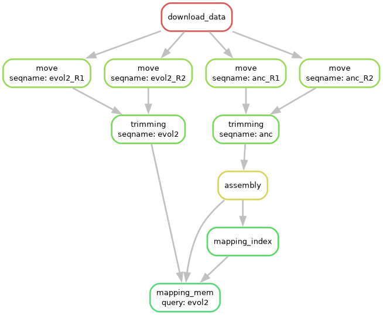

# snakemake-pixi

In this snakemake workflow, the reads from two different genomes are compared
via mapping.



## Installation

The following commands install dependencies of the workflow in the _current_
directory within the `.pixi` folder. After installation, you cannot move the
folder without re-installling all the dependencies. 

```bash
curl -fsSL https://pixi.sh/install.sh | bash
# ... cd <this repo>
pixi install
```

## Usage

Run `pixi run help` for the help page.
